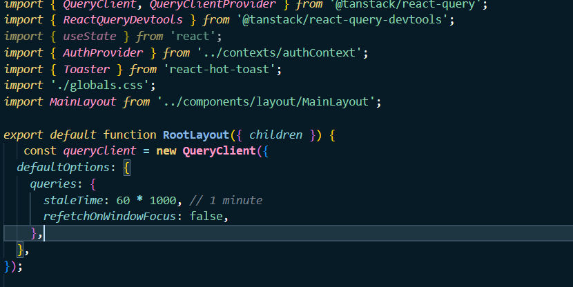

# Reflection – Practical 1: TikTok Clone
---

## Documentation

### Concepts Applied:

- **Next.js App Router:** Used for file-based routing and layout composition.
- **Tailwind CSS:** Simplified UI development with utility classes.
- **React Components:** Built reusable components (VideoCard, VideoFeed, MainLayout).
- **React Hook Form:** Managed form state and validations for login and signup.
- **Project Structuring:** Created a modular, maintainable folder structure under src/.

---

##  Reflection

### What I Learned:

- How to scaffold and configure a Next.js app with modern tools.
- Building layouts using reusable React components.
- Structuring a real-world project using best practices (e.g., separating layout, UI, and pages).
- Using react-hook-form to build and validate forms efficiently.
- Handling form validation, error messages, and submission logic.

### Challenges Faced:

#### 1. Form Validation Logic
It took time to understand how to validate matching passwords and display errors. I resolved it by using a custom validate function inside react-hook-form.

#### 2. App Router Confusion
At first, I wasn’t sure how nested routing and layouts worked in the new App Router. Reading Next.js documentation and testing through trial and error helped clarify this.

### Key Takeaways:

- Tailwind CSS speeds up layout design significantly.
- Form libraries like react-hook-form reduce boilerplate and improve validation workflows.
- A clean folder structure is key to scaling any React/Next.js app.

---
